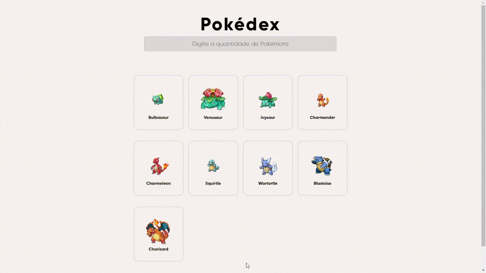

<h1 align="center"> Pokémons </h1>

# Projeto
Utilizar dos dados da pokeapi para criar uma lista de pokémons.
# Link
> https://gustav0dedeus.github.io/Pokemons/
# Linguagens
 * <h2>HTML</h2>
 * <h2>CSS</h2>
 * <h2>JS</h2>